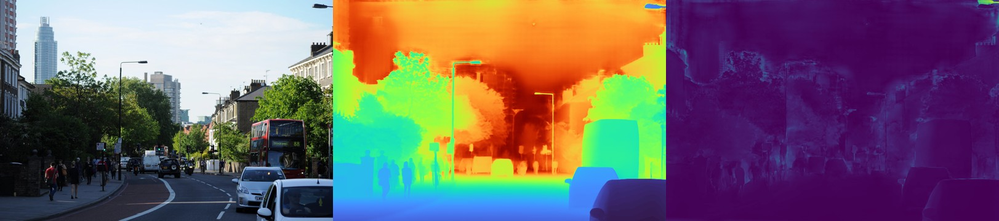
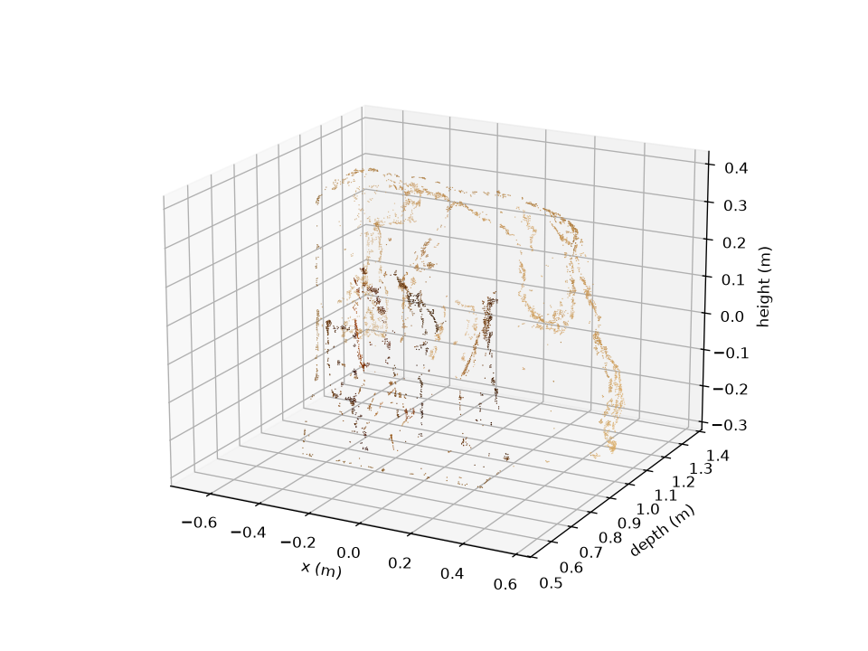
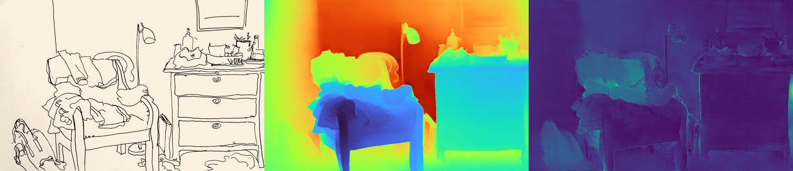
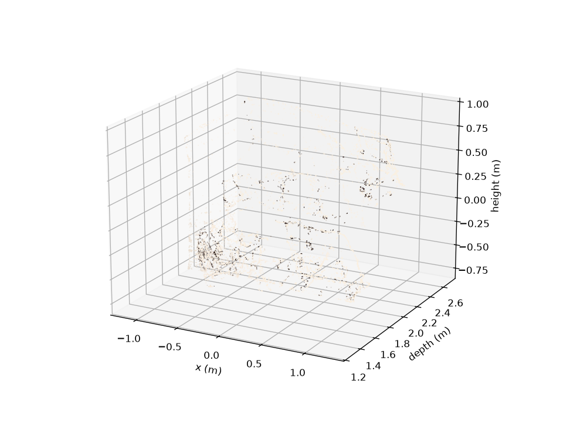

# DepthCraft

[](https://github.com/khalequzzamanlikhon/depthcraft/actions/workflows/ci.yml)
[](LICENSE)
[](pyproject.toml)

Monocular depth estimation → metric point cloud → virtual tape measure, with a
FastAPI backend, a Gradio demo and a React/Three.js viewer. Multi-view (COLMAP +
TSDF + Poisson) and 3D Gaussian Splatting paths are implemented as optional extras.


*demo01.jpg → Depth Anything V2 Metric-Indoor-Large depth (middle) and test-time-augmentation uncertainty (right), produced on an RTX A5000.*

---

## Verified run (2026-09-15)

Everything below was run end-to-end on a Linux GPU server and every stage finished
successfully. All raw outputs are kept in [`demo_outputs/`](demo_outputs/) (see
[What's in `demo_outputs/`](#whats-in-demo_outputs)).

**Environment:** Python 3.11 (conda), `torch 2.4.1+cu121`, `transformers 4.49.0`,
`open3d 0.19.0`, NVIDIA RTX A5000 (driver 570). Install: `pip install -e ".[dev,depth]"`.

| Stage | What ran | Result |
|---|---|---|
| Tests | `pytest tests/ -v` | **22 passed** (20 s) |
| MVP script | `mvp_demo.py --image demo01.jpg --headless` (the repo script, unmodified) | Real model loaded (`backend: transformers`), 2,789,376 points back-projected → 764,588 after cleaning, `Distance: 17.44 m +/- 0.36 m` |
| Batch demo | 6 images: depth, uncertainty, cleaned point cloud, preview, headless measurement | 6/6 OK, 0 errors |
| Benchmark | GPU inference latency, 30 runs on demo01 (2048×1362) | mean **331 ms**, p50 330 ms, p95 343 ms → **3.0 FPS** |
| Repo benchmark script | `scripts/benchmark_inference.py` | mean 364 ms, p95 382 ms (2.7 FPS) |
| API | `uvicorn depthcraft.api.main:app` + `curl` | `/health` ok (gpu: true), `/depth` → `backend: transformers`, `/reconstruct` → 407,843-point `.ply` |

Model: `depth-anything/Depth-Anything-V2-Metric-Indoor-Large-hf`, cold load 6.6 s.

### Per-image results

| Image | Size | Inference | Depth min / median / max (m) | Mean uncertainty | Points (raw → cleaned) | Headless measurement |
|---|---|---|---|---|---|---|
| demo01 | 2048×1362 | 390 ms | 1.91 / 12.54 / 19.78 | 0.200 | 2,789,376 → 764,588 | 18.63 ± 0.29 m |
| demo02 | 2047×1362 | 405 ms | −0.19 / 5.40 / 13.24 | 0.165 | 2,788,006 → 630,136 | 11.96 ± 0.22 m |
| demo03 | 1990×1295 | 323 ms | 0.52 / 0.77 / 1.48 | 0.027 | 2,577,050 → 6,333 | 1.32 ± 0.02 m |
| demo04 | 1600×1041 | 328 ms | 0.39 / 0.99 / 6.35 | 0.032 | 1,665,600 → 49,371 | 5.13 ± 0.11 m |
| demo05 | 2048×1332 | 331 ms | 1.28 / 2.01 / 2.73 | 0.039 | 2,727,936 → 17,653 | 2.65 ± 0.04 m |
| demo06 | 2048×1362 | 353 ms | 2.30 / 9.82 / 21.21 | 0.407 | 2,789,376 → 714,125 | 16.76 ± 0.31 m |

(Inference times include first-call warm-up on demo01; the steady-state number is the benchmark above.)
Sample images are the Depth Anything V2 repo's `assets/examples/demo0{1..6}.jpg`.

| Close-range scene (demo03) | Cleaned metric point cloud (demo03) |
|---|---|
|  |  |
|  |  |

### What the numbers do and don't show

- **No ground truth was used.** The "headless measurement" is a smoke test: it measures
  the two most distant points in the cleaned cloud and propagates depth uncertainty
  into a ±σ / 95 % CI. It proves the measurement path works; it is not an accuracy figure.
- **Indoor metric model on outdoor scenes.** demo01/02/06 are street scenes, outside the
  Metric-*Indoor* checkpoint's range. Depth saturates around ~20 m, demo02 has a small
  negative minimum (−0.19 m), and the mean uncertainty is roughly 4–15× higher than on
  the close-range scenes. Use the Metric-Outdoor checkpoint for those.
- **Point-cloud cleaning is aggressive on close-range images.** demo03 keeps 6,333 of
  2.58 M points (0.25 %). The result is a clean outline of the object (see the preview),
  but it's too sparse for dense meshing without tuning the outlier-removal radius.
- **Model-load timeout.** `DepthAnythingEngine` gives up after 20 s
  (`MODEL_LOAD_TIMEOUT_S`) and falls back to the classical estimator. A cold load of the
  1.3 GB checkpoint can exceed that, so the run raised it to 600 s through a wrapper
  (`demo_outputs/run_scripts/patched_run.py`) without editing the repo. On slow disks or
  networks, raise the constant or check `engine.backend` before trusting results.
- Not exercised in this run: COLMAP SfM/MVS, TSDF fusion on real sequences, SAM 2
  masking, 3DGS training, ONNX/TensorRT export, Gradio and React frontends.

---

## Quick start

### CPU (no GPU, classical fallback depth)

```bash
python3 -m venv .venv && source .venv/bin/activate
pip install -e ".[dev]"
pytest tests/ -v                                   # 22 passed
python mvp_demo.py --image path/to/photo.jpg --headless
```

### GPU (real Depth Anything V2)

```bash
pip install torch==2.4.1 torchvision==0.19.1
pip install -e ".[dev,depth]"
python -c "from depthcraft.depth.depth_anything_engine import DepthAnythingEngine as E; print(E().backend)"
# "transformers" = real model, "fallback" = classical estimator
python mvp_demo.py --image path/to/photo.jpg --headless
```

Drop `--headless` for an interactive Open3D window where you shift-click two points to measure.

### Reproduce the verified run

The exact scripts used are in [`demo_outputs/run_scripts/`](demo_outputs/run_scripts/):

```bash
python demo_outputs/run_scripts/depth_demo.py --images <dir of jpgs> --out demo_outputs
python demo_outputs/run_scripts/patched_run.py scripts/benchmark_inference.py --image <jpg> --n-runs 30
```

`run_all.sh` (same folder) is the full orchestration script, including conda env creation
and pinned constraints (`torch 2.4.1`, `numpy<2`, `transformers<4.50`).

---

## Full-stack app

```bash
uvicorn depthcraft.api.main:app --host 0.0.0.0 --port 8000     # API, docs at /docs
python -m depthcraft.visualization.gradio_app                   # Gradio at :7860
cd frontend && npm install && npm run dev                       # React/Three.js at :3000
docker compose -f docker/docker-compose.yml up --build          # GPU stack
docker build -t depthcraft:cpu -f docker/Dockerfile.cpu .       # CPU image
```

Verified API calls (responses saved in `demo_outputs/api/`):

```bash
curl http://localhost:8000/api/v1/health
# {"status":"ok","gpu":true,"models_loaded":["depth:transformers"]}
curl -X POST "http://localhost:8000/api/v1/depth?with_uncertainty=true" -F "file=@demo01.jpg"
# {"job_id":"…","depth_map_url":"/outputs/…/depth_vis.png","uncertainty_map_url":"…","backend":"transformers","width":2048,"height":1362}
curl -X POST http://localhost:8000/api/v1/reconstruct -F "file=@demo01.jpg"
# {"job_id":"…","pointcloud_url":"/outputs/…/pointcloud.ply","mesh_url":null,"splat_url":null,"num_points":407843}
```

---

## Optional extras

| Extra | Install | Needs |
|---|---|---|
| Metric depth (Depth Anything V2 / Metric3D) | `pip install -e ".[depth]"` | Hugging Face access, GPU recommended |
| COLMAP SfM + PatchMatch MVS | `pip install -e ".[sfm]"` | COLMAP system library (`apt install colmap`) |
| SAM 2 / YOLOv8-seg masking | `pip install -e ".[masking]"` | SAM 2 checkpoint |
| 3D Gaussian Splatting | `pip install -e ".[splat]"` | CUDA GPU, nerfstudio/gsplat |
| ONNX / TensorRT export | `pip install -e ".[onnx]"` | TensorRT for the engine build |

Multi-view pipeline:

```bash
ffmpeg -i room.mp4 -vf fps=1 data/frames/room/frame_%04d.jpg
python scripts/dense_recon.py --frames_dir data/frames/room --output_dir outputs/room
python scripts/train_3dgs.py --colmap_path outputs/room/sparse/0 --output outputs/room/splat --backend nerfstudio
python scripts/export_splat.py --input outputs/room/splat/point_cloud.ply --output outputs/room/scene.splat
```

---

## What's in `demo_outputs/`

```
demo_outputs/
├── summary.json                  # per-image stats + benchmark (source of the tables above)
├── benchmark_inference.txt       # scripts/benchmark_inference.py output
├── demo01 … demo06/
│   ├── depth.npy                 # float32 metric depth (m), image resolution
│   ├── depth_vis.png             # colourised depth
│   ├── uncertainty_vis.png       # TTA uncertainty
│   ├── panel_rgb_depth_uncertainty.jpg
│   ├── pointcloud.ply            # cleaned metric point cloud (git-ignored: *.ply)
│   └── pointcloud_preview.png
├── mvp_demo_repo/                # output of the unmodified mvp_demo.py
├── api/                          # health/depth/reconstruct JSON responses, returned PNGs, uvicorn log
├── logs/                         # full stdout/stderr of every stage (setup, tests, demo, bench, api)
├── run_scripts/                  # run_all.sh, constraints.txt, depth_demo.py, patched_run.py
└── STATUS.tsv                    # stage, result, duration (includes a first attempt that failed before setup finished)
```

---

## Project layout

```
depthcraft/
├── api/              # FastAPI app + routers (depth, reconstruct, measure, export)
├── depth/            # Depth Anything V2 / Metric3D, scale alignment, uncertainty, ONNX export
├── masking/          # SAM 2 / YOLOv8-seg dynamic object masking
├── sfm/              # feature extraction, matching, COLMAP + ORB-SLAM3 wrappers
├── mvs/              # PatchMatch MVS wrapper, confidence-aware fusion
├── reconstruction/   # point cloud cleaning, TSDF fusion, Poisson meshing, texturing, 3DGS
├── measurement/      # AprilTag calibration, ray casting, uncertainty-aware measurement
├── visualization/    # Open3D viewer, web export, Gradio app
├── room/             # floor/wall planes, floor plans, object measurement
└── utils/            # geometry, IO, logging
frontend/             # React + Three.js + Vite viewer
scripts/              # benchmark, export, training, dense_recon
tests/                # pytest suite (22 tests)
docker/  config/  docs/
mvp_demo.py           # single-image demo
Makefile              # make install / test / lint / api / gradio / mvp IMAGE=… / docker-up
```

## Troubleshooting

- **`backend` is `fallback`** — `torch`/`transformers` missing, no Hugging Face access, or
  the 20 s model-load timeout was hit (see above).
- **`pycolmap` import errors** — install the COLMAP system library, then `pip install -e ".[sfm]"`.
- **Very few points after cleaning** — pass an explicit `radius=` to `clean_pointcloud()`
  for close-range captures.
- **`ns-train` not found** — `pip install -e ".[splat]"` on a CUDA machine.
- **Docker GPU build fails without a GPU** — use `docker/Dockerfile.cpu`.

## License

MIT — see [LICENSE](LICENSE). Depth Anything V2 weights carry their own licence.
